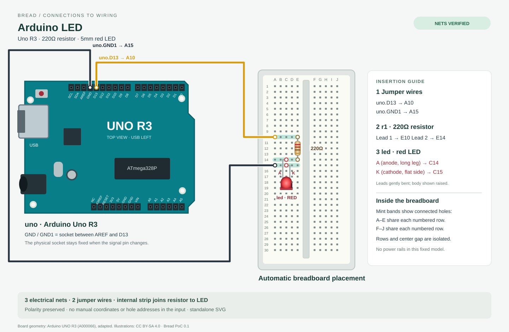

# bread-poc

Local preview extension: the user-requested [three-LED example](examples/three-leds.bread)
adds exactly three resistor/LED branches on D13/D12/D11 with one shared ground.
See [scope and verification](docs/three-led-preview.md). The original one-LED
PoC below remains supported and its output is preserved. This extension does
not claim general-purpose routing.

Connection-only `.bread` → automatically placed, electrically checked breadboard
wiring → standalone SVG. This PoC supports one Arduino Uno R3, one 220Ω resistor,
one 5mm red LED, and a system-added breadboard with two jumpers.



## Run

Node.js **24 or newer** is required. There are **no runtime dependencies** or
build steps: Node runs the erasable TypeScript directly.

```sh
./bin/bread check examples/blink.bread
./bin/bread render examples/blink.bread -o output/blink.svg
```

For the literal `bread` command, add this checkout's `bin` directory to your
shell's executable search path. `node src/cli.ts ...` works on Windows too.

```bread
bread 0.1

title "Arduino LED"

part uno: arduino-uno-r3
part r1: resistor [value=220ohm]
part led: led-5mm-red

uno.D13 -- r1.1
r1.2 -- led.A
led.K -- uno.GND
```

There are no input coordinates, holes, rotations, wire paths, or layout hints.
`//` comments and a quoted optional title are accepted. IDs are case-sensitive
ASCII letters followed by letters, digits or underscores (up to 24 characters).
Titles allow JSON string escapes and at most 64 printable characters.

`GND` is a stable alias of `GND1`: the **upper-header socket between AREF and
D13**, with USB on the left. Other physical ground sockets are never substituted.
Uno positions come from the official CAD; see [hardware sources](docs/hardware-sources.md).

## Scope and behavior

- D13 and D12 series circuits are supported. Other valid Uno pins/topologies fail
  with `E_UNSUPPORTED_CIRCUIT`; nonexistent pins fail with `E_UNKNOWN_PIN`.
- Arbitrary component IDs, reversed resistor terminals, reordered connections,
  and explicitly reversed LEDs work. A reversed LED remains reversed and emits
  `W_LED_POLARITY`; Bread does not silently correct input or simulate illumination.
- The fixed breadboard has 30 rows, A–E and F–J groups, an isolated center gap,
  and no power rails. Canonical resistor leads: E10/E14; LED: C14/C15;
  signal jumper: A10; ground jumper: A15. These are **outputs**, never inputs.
- Exactly one lead or jumper occupies each used hole. The resistor and LED
  remain separate two-terminal components, not conductors that merge their nets.
- `check` runs the complete validation and placement pipeline. `render` runs
  the same checks and writes only after they pass. Failure exits with status 1,
  prints a stable code and preserves any existing output (which may then be stale).
- No simulation, firmware, AI service, web playground, Markdown plugin, manual
  layout, PNG export, or general-purpose circuit solver is included. PNG files
  in `output/` are browser screenshots used for review, not another CLI format.

## Architecture

`parser → semantic resolver → logical netlist → placement → physical netlist
reconstruction → equality check → routing → SVG`

Placement is deliberately a topology-driven rule for this one circuit family,
as permitted by `poc.md`, rather than a general layout optimizer. It derives which
terminal belongs on each strip from the resolved nets, including reversed input.
Physical reconstruction unions only breadboard metal strips, actual inserted
leads and jumper endpoints. It never reuses the logical edges or expected net
labels. Missing/extra terminals, wrong sockets, shorts, occupied holes, invalid
footprints and electrical mismatches prevent SVG generation. The public SVG
renderer repeats validation so callers cannot bypass it with a modified placement.

Component definitions live in `parts/`; the rendering primitives are in
`src/renderer/`. SVG includes readable insertion guidance and embedded logical /
physical connectivity evidence. Same source and version yields the same SVG bytes.

## Verify

```sh
npm ci --ignore-scripts
npm run typecheck
npm test
./bin/bread render examples/blink-d12.bread -o output/blink-d12.svg
./bin/bread render examples/blink-reversed.bread -o output/blink-reversed.svg
```

Only TypeScript and Node types are development dependencies; `npm ci` is not
needed to run the CLI or tests. Open generated SVG files in a browser.

Read the [acceptance evidence and feasibility decision](docs/feasibility.md),
[existing-tool comparison](docs/comparison.md), and [hardware/asset provenance](docs/hardware-sources.md).
The technical result is **conditional Go**. Beginner comprehension (AC-09) and
AI generation success rates still require user studies; tests alone cannot prove them.

## Scaling study

A further bounded extension packs 4–6 shared-ground branches across both banks of
that same 300-hole board. [Six-LED preview and measured limits](docs/scaling-preview.md)
compare it with the original three branches and a rejected ten-branch request.
Six has 17 wire crossings despite valid physical connectivity; this is not a
claim of clean arbitrary-size routing. Seven and above fail with
`E_PLACEMENT_CAPACITY` for the supported footprint.

```sh
./bin/bread render examples/6-leds.bread -o output/6-leds.svg
./bin/bread check examples/10-leds.bread # expected capacity error
node scripts/measure-scaling.ts
```
